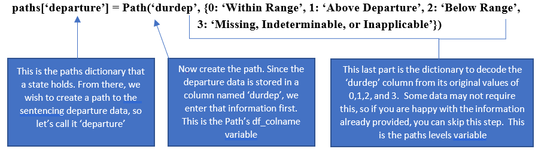
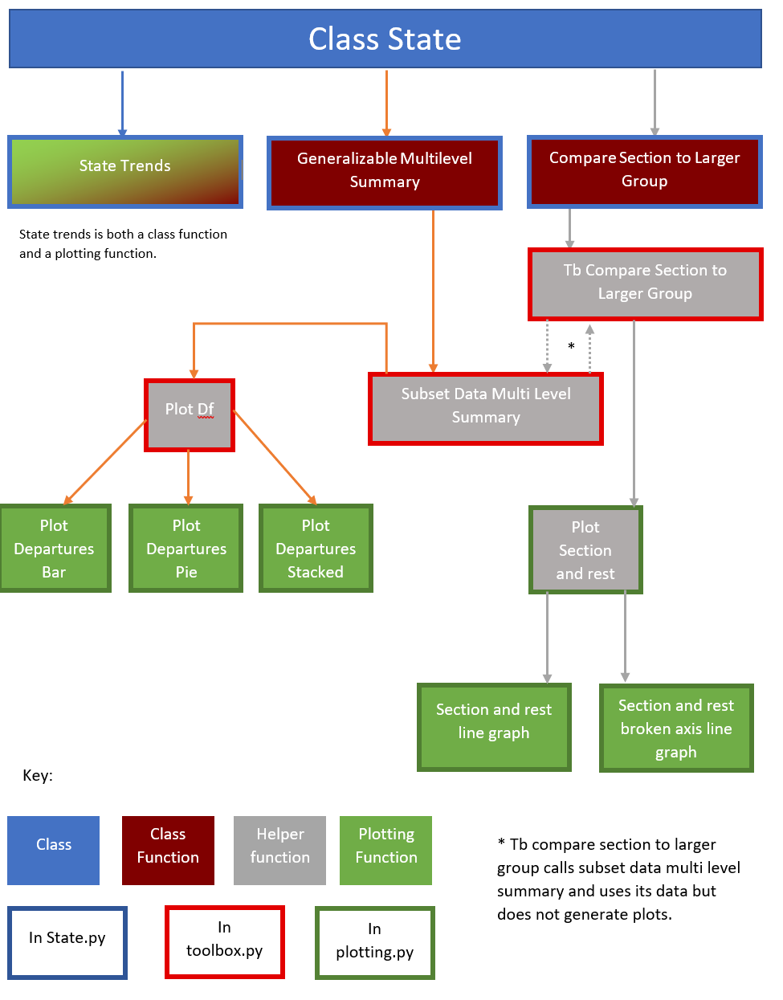
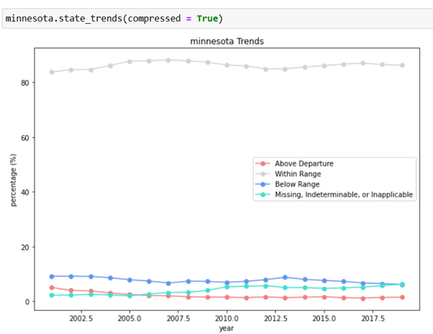
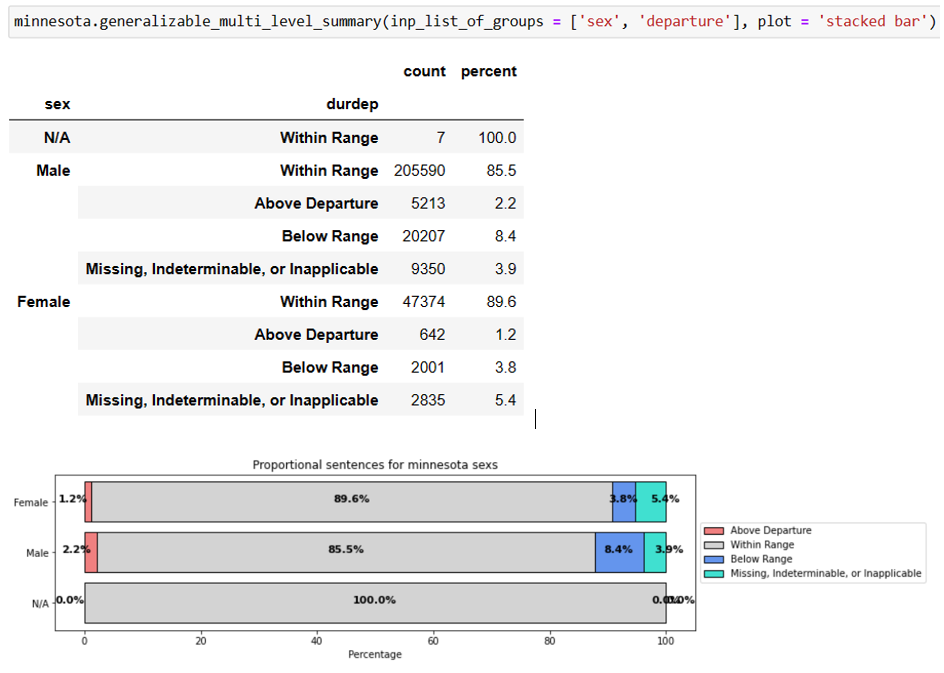
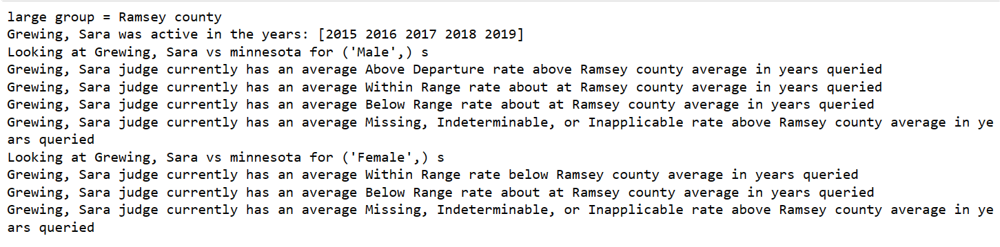
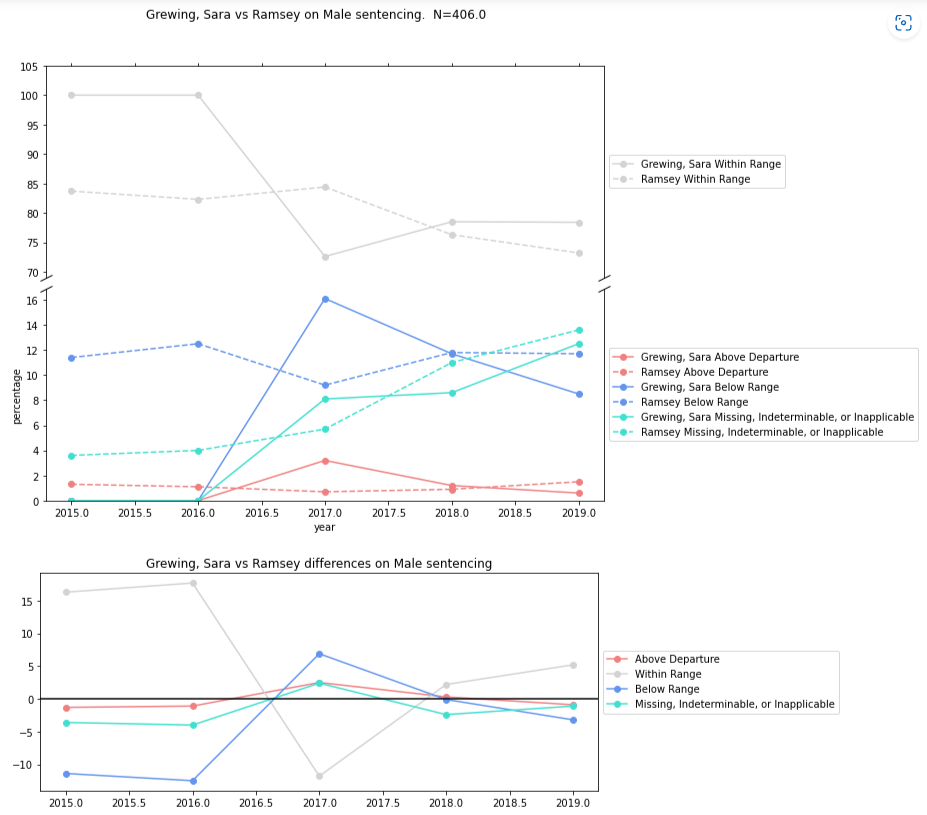

<h1 style="text-align: center;">QSIDE-JUSTFAIR TOOLBOX</h1>
<h5 style="text-align: center;">By Mary Andrews, Alexis Morse, Jason Nitkiewicz, and Kevin Su</h5>


# Abstract
QSIDE JUSTFAIR is an established data justice and equity organization that has partnered with Michigan State University’s Computational Mathematics Science and Engineering (CMSE) Department to create a program that allows for the sorting and analysis of the United States District Court decision data. With the help of fellow data engineers, JUSTFAIR has been expanding its database with the hopes to transfer every state’s record of district judicial data into its database. Now that they are collecting data, they need a way to find significant trends that certify implicit or explicit bias in sentencing. Thus, JUSTFAIR_toolbox, a Python package consisting of object-oriented programming data storage and visualization techniques was created. This package can extract attributes of the data and call for multiple graph plots at the discretion of the user.  The package covers judicial information, as well as departure length analysis and state trend line graph observations. The versatility of functions allows for the package to have mutability when being faced with different data collection methods since every state stores the names of data attributes differently (i.e., sentencing length, race, age, gender, crime committed, judge name, district court name).  Enabling the data visualization of the District Court’s data will be able to identify bias and advance QSIDE JUSTFAIR’s goals to promote justice and equity for citizens under the American federal justice system. 

# Background
In the United States, federal judicial records are public to ensure checks and balances. However, as it stands, judicial power is not necessarily checked. In 2004 the United States v. Booker Supreme Court case decision made it easier for judges to apply sentences at their discretion. This landmark decision makes it so judges can choose to depart above or below the standard sentencing guidelines for the case on trial. This decision gives vast discretion to the Judicial district courts. Nevertheless, it should be assumed that judges are using universal discretion when applying sentencing guidelines for the cases they are presented. There is no system in place to ensure these Judges use said universal discretion. Regardless of assumptions, unintended bias can still emerge.

QSIDE Consortium is an organization that focuses on collaborating with academic institutions and other research teams to develop research relating to data science, social science, activism, and social justice. The goals of this organization are to use data analysis to promote social equity, inclusion, and justice for all United States citizens. After learning about the impact the United States v. Booker decision has had on federal court rulings, the QSIDE created JUSTFAIR (JUdicial System Transparency for Fairness through Archived/Inferred Records) with the aim to have a public platform voters can visit to see an analysis of sentencing on a state level. JUSTFAIR is the first large-scale, public database that holds hundreds of thousands of court records from 2001 to 2018. 

The analysis of these records can provide evidence to claims of sentencing disparities across BIPOC (Black Indigenous People of Color) versus white defendants for similar crimes. Allowing for this transparency can lead to judicial accountability if sentencing decisions appear blatantly prejudiced.  Transparency of court records across 50 states is in the process of being achieved, however, it is difficult to reach conclusions without a forum to perform data analysis on sentencing lengths per district court region.  The task is to create an application that efficiently attains and sorts valuable data from different sources and compounds this information for a variety of purposes relating to average sentencing data visualization. 

The QSIDE JUSTFAIR Toolbox sets out to answer two essential questions:
1.	Do patterns of sentencing outcomes differ by racial groups? 
2.	Are POC sentenced more harshly along the same guidelines compared to white defendants for similar crimes?


# Methodology
Throughout the United States, different states follow different sentencing guidelines and data-keeping practices.  To make the toolbox robust enough to handle these differences, classes were developed to represent individual states, allowing users to customize the state to suit their needs. This mutability of attribute names enables the plotting functions to be used no matter the style type that each state keeps track of its data.
## The Class Based System
Three classes were developed to assist in managing state information: a State class to represent a state and its data, an ACS (American Community Survey) class to represent census data, and the Path class to integrate data. The State class holds the Path class's data to allow for sorting and accessing certain data variables necessary for uncovering sentencing disparities. The State object functions as a location for each state’s data to be called upon for analysis. Using class objects allows for all relevant information for analysis to be kept in one place as well as providing an easy way to call analysis functions.
### Class State
The State class is the backbone of the toolbox, providing a way to easily store, access, and analyze state judicial data.  State’s hold two main components:
* State judicial data, loaded from a CSV on the JUSTFAIR program google drive.  Only two pieces of information are necessary for analysis functions to work:
    * A column denoting sentencing departure.  This column will qualify if an individual’s sentence was above the recommended sentencing (above departure), within range, or below recommended sentencing (below range), or was missing.
    * A column keeping track of what year sentencing took place.
* A dictionary of Path Classes. This dictionary is to format and access information from a state’s Judicial data.
Additionally, the State class is how all analysis functions are called.  This is convenient because once a state object has been set up, the object is stored for later use and never needs to be reinitialized unless the fundamental paths of the database have been reorganized by data engineers.  To create a state class, one must have a thorough understanding of the state’s data and moderate programming knowledge.  The class state has to have its name, a link to the data set, and a dictionary of Path Class objects. There are attributes connected to the functionality of the plotting functions such as ‘*years*’, ‘*average_percents*’ , and ‘*yearly_average_percents*’. The attribute ‘*years*’ is used as a container for when the user needs a span of time to measure their data analysis. There are functions that utilize these values in the computation such as ‘***state trends*** , ‘***generalizable multi level summary***’, , and ‘***compare section to larger group***’.  The attribute ‘*average_percents*’ is a list that contains the overall average of each sentencing departure type. Similar to ‘*average_percents*’, the attribute ‘*yearly_average_percent*s’ holds a dictionary where the key represents the individual year, and the value represents the sentencing departure rates for that year.

### Class Path
When designing this project, an important issue was how data was going to be loaded in and accessed.  Due to no national standards, state data comes in a variety of formats and naming conventions, so a decision had to be made.  Is a strict data format created and all state data formatted to fit those guidelines or is a more flexible approach taken?  The strict formatting is easy to design around but can be rigid and unforgiving to data formats that don’t follow the schema.  For the flexible approach, state data can be integrated more easily, but has to be set up each time.  Overall, due to the very different formats that different states have, a more flexible approach (a Path class system) was taken.

The Path class is designed to integrate state judicial data into a workable format.  Essentially, the Path class acts as a guide for analysis functions, pointing them to where the appropriate data they seek is.  It is important to note that all functions are based off a state’s paths rather than its data, so only data that has path objects associated with it can be utilized.  All Path objects have two values: one that tells users where the information they seek is (df_colname), and another to decode that information if it is encoded (levels).  Explanation of the Path class’s member variables:
1.	df_colname (string): this variable stores the name of the column in the state’s data this path points to.
2.	levels (dictionary): this is an optional dictionary that decodes encoded state data.  Use the state’s data dictionary from the JUSTFAIR google drive to see if this is needed.

Overall, all of these Path objects are stored in a State object’s paths dictionary, with the mapping of term: Path object.  As mentioned earlier, all of a State object’s functions work with the terms in the State’s paths dictionary, so when a user enters a term to analyze, the dictionary outputs a Path object that can tell the function where to find the data and how to decode it.
##### How paths are used
Let’s look at Minnesota’s data for an example.  Minnesota stores its departure data in a column named ‘durdep’.  Values in the durdep column are 0,1,2,3, but the state’s data dictionary tells us that those values actually mean ‘within range’, ‘above departure’, ‘below range’, and ‘missing, indeterminable, or inapplicable’.  To set up the path for this object, one could use code similar to the example below.  Please see the package testing notebook for an in-depth example.




### Class ACS
The state toolbox currently does not have a function that can compare with the demographic it represents. To address this problem, the team decided to create a prototype implementation of a feature by developing a class object. This class object provides quick access to the demographic data in the form of a Pandas data frame, making it easy to use and flexible. Although this class object is just a band aid solution for now, it serves as a starting point that future users and developers of the toolbox can build upon and enhance in the future. 

The ACS.py module is designed to extract relevant American Community Survey (ACS) data from the census database for counties in a state. This module retrieves demographic data based on the years for which the survey has data available. Currently, the available years of data range from 2011-2021, but data for 2020 is missing. For each year, the module retrieves three key demographic data points: race, age, and sex. When the Demographic class object is called with a state and year specified, the data is automatically stored in a dictionary. The dictionary contains three Pandas data frames, each representing one of the demographic aspects. The data frames are divided into counties, allowing for analysis of specific regions within a state. 

## Flow of Information


# Results
Overall, the outcomes of the python package toolbox project were quite successful in its efforts of data sorting and visualization.  While the total amount of available tools is somewhat small, the underlying foundation they are built on is very strong.  Through the use of paths making data flexible and the subsequent writing of functions based off of the paths, the final tools are very robust.  They will work with any number of paths, provided they exist, and the functions will work on any subset of the state’s data.  Secondly, for the Compare section to larger group, it can work for any two groups, provided the first group is a subset of the second.  


## State Trends
The State Trends function is a small, easy to use function to analyze the current sentencing pattern of a state.  All this does is use the state’s *years* and *yearly_average_percents* to create a quick line plot showing how the state’s sentencing departures have changed with time.  There is only one parameter, compressed, which dictates if the lines are plotted together or separately.



## Generalizable Multi Level Summary / Subset Data Multi Level Summary
Generalizable Multi Level Summary is a nice function to get summary statistics for each combination of a group of paths provided as input.  More specifically, Generalizable Multi Level Summary filters the state data for a set of years and then calls the helper function Subset Data Multi Level Summary.  The reason for this split is so Subset Data Multi Level Summary can be used by other functions in addition to Generalizable Multi Level Summary.

Subset Data Multi Level Summary does the analysis and using the ‘*inp_list_of_groups*’ parameter passed into the function, provides the sentencing breakdown for the inner join of those groups’ values.  For example, if the groups were ‘*race*’ and ‘*sex*’, some example values of the inner join might be ‘*white female*’, or ‘*Asian male*’.  From there, for each value in that inner join, the sentencing breakdown is obtained.  This breakdown is calculated by getting the proportion of each sentencing type for that group, spanning all years queried. The output will produce a data table showing numeric values as well as a data visualization plot whose plot type is specified by the parameter ‘*plot*’. There are three plot types that the user can create a visualization of (stacked bar graph, bar graph, and pie chart). These plot types display the same information and can be changed efficiently by rerunning the function with one of the following plot names: ‘*stacked bar*’, ‘*bar*’, or ‘*pie*’. The plot title changes based off the name of the state object (ex: ‘Minnesota’).  The graphs provide a comparative analysis of sentencing length for each column value that has been inner joined on. 


## Compare Section to Larger Group
Compare section to larger group is a function that can take in two areas and compare them.  The first area is the section, and it must be a subset of the second area, the larger group.  For example, the first area could be a judge and the second area could be the county they operate in.  From there, this function performs two levels of analysis: as an aggregate and then by year.  First, the function finds when the section and the larger group have overlapping data and filters both groups to only contain the years where both groups have data.  After that, the ***subset_data_multi_level_summary*** function is called to get the counts and percentages for all combinations of the *inp_list_of_groups*.  Then, it looks at the sentencing breakdown of each combination and compares the sentencing rates for the section and larger group, printing if the section rate is above (\> 105%), below (<95%) or just about at (95%-105%) the larger section’s sentencing rate.  After that, the function filters the data for year-by-year analysis, storing the values and creating plots of the sentencing trends over time.  Finally, it creates the plots and returns the data used to make them in case the user wants to investigate the results more. 
##### Text Output:


##### Graph Output:


# Future Work
Over the course of working for QSIDE JUSTFAIR, the team has created a Python package that allows for the sorting and visualization of data. There are limitations to the toolbox due to the technical knowledge prerequisite. The user must have knowledge of Python dictionaries and class object inheritance to understand how to set up the toolbox. There are documentation code examples for the user to assist them, however, there are further steps that can be taken to make the program more intuitive to the inexperienced user.  To extend the usefulness of the toolbox, three roadmaps have been created: one to expand the toolbox’s functionality, one to enhance user experience, and one to acquire more data.  Through these three roadmaps the toolbox can be easily expanded.
## Roadmap One: Expanding and Upgrading the Current Toolbox
The first set of future plans are towards improving the current toolbox.  These changes will be to improve current tools and make new ones to aid in analysis.  Below is a list of changes that could be implemented:

### Improving the current toolbox functions
* Rework ***state_trends*** to have a split axis graph similar to the plots shown in ***compare_section_to_larger_group***.
* Add an option to the ***plot_departures_*** group of functions to also return graphs with the counts as well.
* Currently, analysis tools are based off a list called *unique_identifiers*, which is the index of the DataFrame ***subset_data_multi_level_summary*** returns.  However, if an item is missing (0 were sentenced), it won’t show up in the analysis, as it won’t appear in the data frame.  To fix this:
    * Using the paths, their levels, and potentially the pandas series .unique() function (if levels is None), create a new list of unique_identifiers for the analysis functions to use.  This would then contain all combinations rather than just the ones that appear in the data.
    * Make this code a helper function, as it appears in several functions right now.
* Fixing output formatting.  Right now, for ***compare_section_to_larger_group***, outputs are always in the format of ‘*section name*’ and then ‘*category name*’.  This makes judge and state’s name formatting strange, so if a provision could be added to switch the order if a judge or a state is being analyzed, that would be good for formatting.
* ACS Data is currently loaded in via saved files on JUSTFAIR’s google drive.  In the future, ideally these files could be loaded directly from census.gov using the selenium python package.
    * Another consideration to keep in mind is finding more robust data sets that include more years of data for the ACS data.
    
### Adding new functionality
* Add a chi-squared test to test if a section’s sentencing rates are significantly different from the larger group it is part of (either add to compare section to larger group or make a new function)
    * Use the following formula to calculate the expected values for the chi squared analysis: $$expected\, value= \frac{larger\,  group\,  count}{larger\, group\,  total\,  sentenced} * section\,  total\,  sentenced$$.
    * Make sure to save the expected and actual values in a dataframe, as with sentencing data there can be very small numbers of cases at times.  This probably is only good for one group, maybe two besides departure in *inp_list_of_groups*.
* Implement comparison of sentencing rates to a county’s ACS data.
    * Compare population proportions to sentencing proportions: are they different from one another. It is probably best to use the Chi squared test again here, but since this is looking at year by year analysis, counts might be too small to get reliable results.
    * Also, potentially create and compare to larger population groups (districts, states) by aggregating ACS county data.
* Add saving and loading functions to state objects.  There are two options on how to approach this.
    * Save everything the state object holds (including its data) to a .json file and make saving and loading functions.  From there, put the .json files on JUSTFAIR’s google drive and save and load them from there.
    * Save everything but the state’s data.  Instead add an attribute called *data_url* that stores the URL needed to access the data already present of JUSTFIAR’s google drive.  This would shrink the amount of space needed to store state objects on JUSTFAIR’s drive greatly. 
* Work with Social Scientists on JUSTFAIR to develop a scorecard function to evaluate a judge’s sentencing bias.
    * Most likely, will need the following metrics:
        * How much more / less biased a judge is than the county they operate in (easy to accomplish, already partially done in compare section to larger group)
        * Once ACS data is integrated, potentially use how much a judge’s sentencing patterns match their county demographics.
* Other things to consider:
    * Offence number.
    * Crime type.
    
### Integrating other work from previous JUSTFAIR teams
* From the 2022 MSU JUSTFIAR team: https://github.com/carliecouz/justfair-msu 
    * In the examples folder, there is a sample web scraper.  May be useful for roadmap 3: data curation.
    * In the figures folder, there are some plots that may be interesting.  If useful, integrate them into the JUSTFAIR package.
* From the QSIDE-MSU-2022 google drive https://drive.google.com/drive/u/0/folders/1MQas-K7uZHU6sg-23sqCIT0fWI69RkF- 
    * There is a state of states folder in JUSTFIAR’s drive (link above).  There’s a notebook and .py file present that are used to make figures analyzing the country.  This would be nice to integrate into the toolbox, probably under a nation class (see roadmap 2)
    
## Roadmap Two: Enhancing User Experience
The second roadmap for future work involves creating an interactive website for the public to use.  Implementing the GUI would allow not only for a nicer end-user experience but also can eliminate erroneous inputs.  The GUI would implement the following:
* Create a website that can access the JUSTFAIR_Tools python package.
* Create a Nation class that can load and unload state objects, as well as display nationwide graphics such as how much data has been recorded for each state.  See the QSIDE-MSU-2022 google drive’s state of states subfolder https://drive.google.com/drive/u/0/folders/1MQas-K7uZHU6sg-23sqCIT0fWI69RkF- for more details.
* Add a user-friendly GUI that makes creating queries easy.  The GUI should include:
    * New functionality: specific section analysis
        * ***Subset data multi level summary*** works for any subset of a state’s data.  While building the function was easy, building an easy way to use it is not.  Using the GUI, a user could fill in radio buttons to select a specific area they want to analyze, and then get the output of ***subset data multi level summary*** for that region.
    * Improved ease of use: compare section to larger group.
        * When filling out the ***compare section to larger group*** function, a user would first pick the category (radio button list) of the section they wish to analyze.  From there, they then are given another radio button list of all available entries for that category (ex: category = ‘judge’, next selection is picking a specific judge to analyze from all judges in the state).  After that, when picking the larger group, the only available options to select are valid options.
        * Example: let’s say a user wants to analyze judge Judy from county C in district D from state S. First, after selecting the category judge, then all the judges with data in state S appear for the next selection.  Once judge Judy is picked, the only available larger group options would be county C, district D, and state S. This would prevent erroneous inputs and make calling the analysis easier.
* This could also work backwards.  If a user selected the larger group first, the only available options to select for the subsection would be those that are part of the larger group.
    * Adding interactive maps
        * This builds off roadmap 1 and creates a scorecard for judge bias.  As well as integrating ACS data.
        * Create a colored map with the color corresponding to the difference between the county’s sentencing patterns and the county’s demographic data.  This could take any number of attributes into consideration, so discuss the scoring metric with JUSTFAIR’s social scientists.
        * After that, if a user hovers their mouse over the county, the bias scores for each judge in the county are presented as well as the number of sentences each judge made.
    * This will need state objects created for several states before it becomes useful, but at the moment one could at least do most of the things for Minnesota.  Part of this project could be designing and constructing new state objects.
    
## Roadmap Three: Data Curation
Lastly, an important phase of the JUSTFAIR project will be collecting judicial data from as many states as possible.  The issue is every state has its own public portals and its own way of storing judicial data.  The goal of this branch of the toolbox is to make functions to scrape data from public portals and connect datasets to be in a usable format by the toolbox.  The idea would be to build some base functions which could then be copied and customized to make functions to curate state data for any of the 50 states.  Some base functions could include:
* Web scraping tool.  A good start might be the code in the MSU 2022 JUSTFAIR team’s GitHub: https://github.com/carliecouz/justfair-msu.
* Additionally, some functions may need to be written to decode some file formats, notably pdf files.  It may be advisable to use R libraries, as R has many good pdf reader libraries.
* Finally, a tool may be needed to connect multiple csv files into one big csv file.


# Conclusions
Overall, this project has been a success. While the overall breadth of tools created fell short of the initial project description, the code that is written is very resilient and should provide an excellent foundation to future teams.  The team has taken time to think of next steps and provide a specific roadmap on how and where to expand the toolbox. So, the future of this toolbox is in good hands with the rest of the QSIDE JUSTFAIR program.  While this year’s team may not be here to see the final toolbox, it is an honor to have been there for the beginning!

-Mary Andrews, Alexis Morse, Jason Nitkiewicz, and Kevin Su.

# Acknowledgements
The QSIDE JUSTFAIR Toolbox team would like to thank Jude Higdon, Chad Higdon-Topaz, and the QSIDE organization for sponsoring this project.  Additionally, thanks to Dirk Colbry and Serena Lotreck for their help and guidance throughout the process.


# Appendices
Git Hub link: https://github.com/nitkiew2/QSIDE-JUSTFAIR-TOOLBOX 

Overall structure of the project.
* JUSTFAIR_Tools: Folder: this contains the toolbox.
    * __init__.py: this is a setup file for the package
    * ACS.py
        * Class Demographic.  Functions:
            * __init__()
            * get_url
            * pull_data
            * get_columns
            * make_columns_dict
            * make_state_database
            * race_data
            * sex_data
            * age_data
            * state_select
            * get
    * Path.py
        * Class Path.  Functions:
            * __init__()
    * State.py
        * Class State.  Functions:
            * __init__()
            * List_paths
            * Calc_state_avg_for yearspan
            * State_trends
            * Generalizable_multi_level_summary
            * Compare_section_to_larger_group.  Variants:
    * Compare_judge_to_county
    * Compare_judge_to_state
    * Toolbox.py.  Functions:
        * Filter_years
        * Plot_df
        * Subset_data_multi_level_summary
        * Tb_compare_section_to_larger_group
    * Plotting.py.  Functions:
        * Plot_departures_bar
        * Plot_departures_pie
        * Plot_departures_stacked
        * plot_section_and_rest_data.  Calls:
            * section_and_rest_data_plot_line_graph
            * section_and_rest_data_plot_broken_axis_line_graph
* Older Notebooks: This has old legacy code that is not in use anymore.  May be useful for inspiration or reference.
* Package_testing.ipynb: demo file
* Install.md: install instructions
* license.txt: license file 
* README.md: readme file for the notebook
* Setup.py: setup file for the package


```python

```
